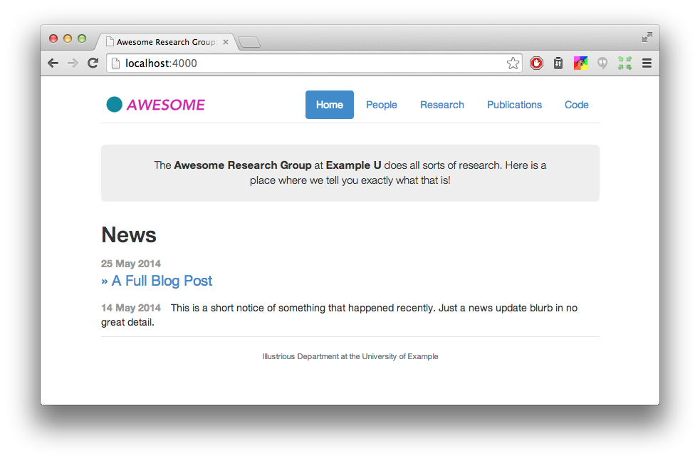

中国科学院计算机网络信息中心大数据部科研团队学术主页
================================

添加/修改个人信息
--------
* 个人基本信息添加到 _data/people.yml 文件下，可添加display_name(显示姓名)、
webpage(个人主页链接，如无可以在该工程下创建静态页面)、image(个人头像)、
role(角色)、bio(简要描述)、github(github账号)
* 个人图片添加到 img/people 目录下

添加/修改项目信息
--------
* 项目信息在 _projects目录下，使用MarkDown语言进行编辑

添加新闻、博客信息
--------
* 新闻、博客信息在_posts目录下，使用MarkDown语言进行编辑，
包括长新闻、端新闻、图片新闻。新博客创建时，命名遵循 yyyy-mm-dd-name.md 的格式
* TODO: 后续应将论文研读部分分类出来，单独展示

添加/修改论文、专利等成果信息
--------
* 论文使用bib文件进行管理,修改直接编辑该文件
* TODO:该项目对bib的解析比较苛刻，后续可能需要进行优化

编译及运行
--------
* 直接在项目目录下make,make serve 即可通过 127.0.0.0:5000访问该页面
* make 时遇到如下问题，在scanner.py中修改编码
~~~~
 File "/Library/Python/2.7/site-packages/pybtex/scanner.py", line 85, in update_lineno
    num_newlines = value.count("\n") + value.count("\r") - value.count("\r\n")
UnicodeDecodeError: 'ascii' codec can't decode byte 0xe5 in position 0: ordinal not in range(128)
~~~~

~~~~
import sys  
reload(sys)  
sys.setdefaultencoding('utf8')
~~~~

note:scp -r /data/kgroup/* root@10.0.16.186:/opt/tomcat/webapps/ROOT/

Research Group Web Site Template （原始说明文档）
================================

This is a [Jekyll][]-based Web site intended for research groups. Your group should be able to get up and running with minimal fuss.

This project originated at the University of Washington.  You can see the machinery working live at [our site][sampa].

This work is licensed under a [Creative Commons Attribution-NonCommercial 4.0 International License][license].

[sampa]: http://sampa.cs.washington.edu/
[license]: https://creativecommons.org/licenses/by-nc/4.0/

Features
--------

* Thanks to [Jekyll][], content is just text files. So even faculty should be able to figure it out.
* Publications list generated from BibTeX.
* Personnel list. Organize your professors, students, staff, and alumni.
* Combined news stream and blog posts.
* Easily extensible navigation bar.
* Responsive (mobile-ready) design based on [Bootstrap][].

[Bootstrap]: http://getbootstrap.com/

Setup
-----

1. Install the dependencies. You will need [Python][], [bibble][] (`pip install bibble`), and [Jekyll][] (`gem install jekyll`).
2. [Fork][] this repository on GitHub.
3. Clone the fork to your own machine: `git clone git@github.com:yourgroup/research-group-web.git`.
4. Add an "upstream" remote for the original repository so you can stay abreast of bugfixes: `git remote add upstream git://github.com/uwsampa/research-group-web.git`.
5. Customize. Start with the `_config.yml` file, where you enter the name of the site and its URL.
6. Type `make` to build the site and then run `make serve` to view your site.
7. Keep adding content. See below for instructions for each of the various sections.
8. Periodically pull from the upstream repository: `git pull upstream master`.

[Python]: https://www.python.org/
[Fork]: https://github.com/uwsampa/research-group-web/fork

Publication List
----------------

The list of publications is in `bib/pubs.bib`. Typing `make` will generate `pubs.html`, which contains a pretty, sorted HTML-formatted list of papers. The public page, `publications.html`, also has a link to download the original BibTeX.

News Items and Blog Posts
-------------------------

For both long-form blog posts and short news updates, we use Jekyll's blogging system. To post a new item of either type, you create a file in the `_posts` directory using the naming convention `YYYY-MM-DD-title-for-url.md`. The date part of the filename always matters; the title part is currently only used for full blog posts (but is still required for news updates).

The file must begin with [YAML front matter][yfm]. For news updates, use this:

    ---
    layout: post
    shortnews: true
    ---

For full blog posts, use this format:

    ---
    layout: post
    title:  "Some Great Title Here"
    ---

And concoct a page title for your post. The body of the post goes after the `---` in either case.

You can also customize the icon that is displayed on the news feed. By default it's `newspaper-o`. We use icons from the [FontAwesome][fa] icon set.

[yfm]: http://jekyllrb.com/docs/frontmatter/
[fa]: http://fontawesome.io/icons/

Projects
--------

To create a project, just create a markdown file in the `_projects` folder. Here are the things you can put in the YAML frontmatter:

- `title:` The project title.
- `notitle:` Set this to `true` if you don't want a title displayed on the project card. Optional.
- `description:` The text shown in the project card. It supports markdown.
- `people:` The people working on the project. This is a list of keys from the `_data/people.yml` file.
- `layout: project` This sets the layout of the actual project page. It should be set to `project`.
- `image:` The URL of an image for the project. This is shown on both the project page and the project card. Optional.
- `last-updated:` Date in the format of `YYYY-MM-DD`. The project cards are sorted by this, most recent first.
- `status: inactive` Set this to `inactive` if don't want the project to appear on the front page. Just ignore it otherwise.
- `link:` Set this to an external URL if this project has a page somewhere else on the web. If you don't have a `link:`, then the content of this markdown file (below the YAML frontmatter) will be this project's page.
- `no-link: true` Set this if you just don't want a project page for your project.

Personnel
---------

People are listed in a [YAML][] file in `_data/people.yml`. You can list the name, link, bio, and role of each person. Roles (e.g., "Faculty", "Staff", and "Students") are defined in `_config.yml`.

[YAML]: https://en.wikipedia.org/wiki/YAML

Building
--------

The requirements for building the site are:

* [Jekyll][]: run `gem install jekyll`
* [bibble][]: available on `pip`
* ssh and rsync, only if you want to deploy directly.

`make` compiles the bibliography and the website content to the `_site`
directory. To preview the site, run `jekyll serve`` and head to
http://0.0.0.0:5000.

Deploying to Your Sever
-----------------------

To set up deployments, edit the Makefile and look for the lines where `HOST` and `DIR` are defined. Change these to the host where your HTML files should be copied to.

To upload a new version of the site via rsync over ssh, type `make deploy`. A web hook does this automatically when you push to GitHub. Be aware that the Makefile is configured to have rsync delete stray files from the destination directory.

[Jekyll]: http://jekyllrb.com/
[bibble]: https://github.com/sampsyo/bibble/
